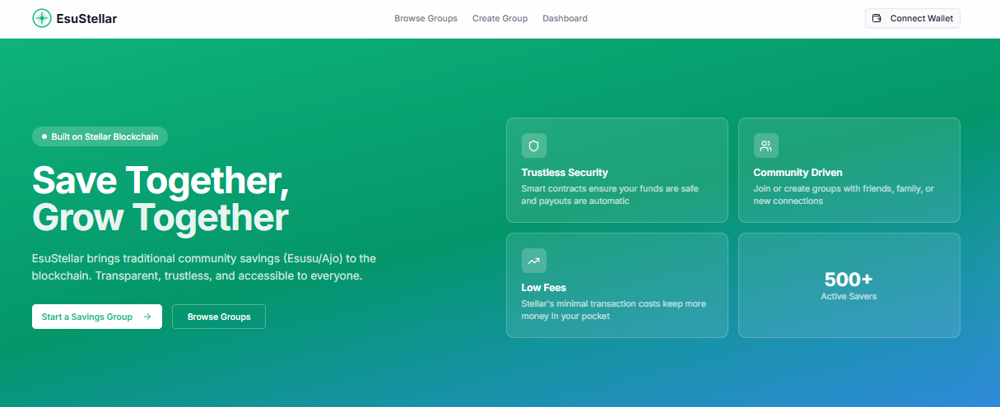

# EsuStellar 🌍✨



[](https://codecov.io/gh/BlockHaven-Labs/esustellar)

Esustellar is an open-source platform that brings informal savings groups
(Esusu / Ajo / Rotating Savings) to the Stellar blockchain.

It helps communities save money together transparently, securely, and
without relying on a single trusted organizer.

---

## 🚨 Problem

Millions of people use informal savings groups, but these systems rely
entirely on trust:

- Organizers can disappear with funds
- No transparency into contributions
- No verifiable payout history
- Disputes are hard to resolve.

---

## 💡 Solution

EsuStellar uses the Stellar network to:

- Provide transparent, on-chain record-keeping for savings groups
- Automate payout rotation based on deterministic join order
- Enable peer accountability through public contribution tracking
- Reduce reliance on a single trusted organizer via smart contract logic

> **Note:** Real token custody (locked escrow), dispute resolution, and
> configurable admin controls are planned for future releases. The current
> MVP records contributions and payouts on-chain but does not yet escrow
> funds within the contract.

---

## 🧩 Core Features

- Create a savings group
- Join a group
- Fixed contribution amount
- Monthly contributions
- Rotating payout to members
- Transparent on-chain records

---

## 🏗 Tech Stack

- **Blockchain:** Stellar (Testnet)
- **Smart Contracts:** Soroban
- **Frontend:** React / Next.js
- **Wallet:** Stellar Wallets (Freighter/lobster/lumen)
- **Monorepo:** npm / Turborepo

---

## 🔄 Contract Architecture

EsuStellar uses two Soroban smart contracts that work together:

### Savings Contract (`contracts/savings/`)

The core contract that manages savings group lifecycle:

1. **`create_group`** — Admin creates a new group with contribution amount,
   member count, frequency, and start date
2. **`join_group`** — Members join an open group. When the group is full,
   it transitions to Active and round 1 begins
3. **`contribute`** — Members contribute their fixed amount each round.
   When all members have contributed, payout is triggered automatically
4. **`distribute_payout`** (internal) — Rotates payout to the next
   eligible member based on join order. Advances to the next round

### Registry Contract (`contracts/registry/`)

A discovery/index layer for on-chain group metadata:

1. **`register_group`** — After creating a savings group, the admin
   registers it in the registry for frontend discovery
2. **`add_member`** — Tracks which users belong to which groups
3. **`update_group_info`** — Re-syncs metadata when group state changes

### Expected Call Sequence

```
1. Admin → savings::create_group(group_id, ...)
2. Members → savings::join_group(group_id) [repeat until full]
3. Admin → registry::register_group(contract_address, group_id, ...)
4. Members → savings::contribute(group_id) [each round]
5. Auto   → savings::distribute_payout (triggered when all paid)
6. Repeat steps 4-5 for each round
```

> **Note:** Registration is optional but recommended for frontend
> discovery. The savings contract operates independently of the registry.

---

## 📂 Repository Structure

```
esustellar/
├── apps/
│ └── web/ # Frontend application
├── contracts/
│ ├── savings/ # Soroban savings contract
│ └── registry/ # Soroban registry contract
├── environments/
│ └── testnet/ # Testnet deployment workspace
├── packages/
│ └── shared/ # Shared types & utils
├── docs/ # Architecture & specs
├── .github/
│ └── ISSUE_TEMPLATE/
└── README.md
```

---

## 🛠 Development & Operations

### Monitoring & Log Aggregation
- **Loki & Grafana**: Centralised log aggregation is pre-configured via Docker Compose (`docker-compose.yml`) and Kubernetes (`k8s/monitoring/`).
- **Validation**: Run `npm run validate-monitoring` to verify log aggregation configurations.
- **Documentation**: See [docs/logging.md](file:///c:/Users/g-obiagazie/Desktop/esustellar/docs/logging.md).

### Utility Scripts
- **Post-Deploy Smoke Tests**: `npm run smoke-test` (automatically invoked after `./deploy.sh`).
- **Export & Archive Contract Event Logs**: `npm run export-events` (exports events to `logs/contract-events.jsonl`).
- **Deployment Guide**: See [docs/deployment.md](file:///c:/Users/g-obiagazie/Desktop/esustellar/docs/deployment.md).

---

## 🤝 Contributing Guide

EsuStellar is open-source and beginner-friendly.

- Look for issues tagged `good first issue`
- Follow the contribution guide (coming soon)
- Open discussions for ideas and improvements

---

## 📜 License

MIT License

