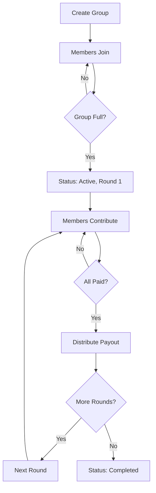

# EsuStellar Smart Contracts 🔐

Soroban smart contracts for the EsuStellar savings platform.

## 📁 Structure

```
contracts/
└── savings/
    ├── src/
    │   ├── lib.rs          # Main contract logic
    │   └── tests.rs        # Comprehensive tests
    ├── Cargo.toml          # Dependencies
    └── deployment-info.json # Deployment records
```

## 🚀 Quick Start

### Prerequisites

1. **Install Rust**
```bash
curl --proto '=https' --tlsv1.2 -sSf https://sh.rustup.rs | sh
```

2. **Add WASM target**
```bash
rustup target add wasm32-unknown-unknown
```

3. **Install Stellar CLI**
```bash
cargo install --locked stellar-cli --features opt
```

### Build

```bash
cd contracts/savings
stellar contract build
```

### Test

```bash
cargo test
```

### Deploy to Testnet

```bash
chmod +x deploy.sh
./deploy.sh
```

The script will:
- Build and optimize the contract
- Deploy to Stellar Testnet
- Save the contract ID to `apps/web/.env.local`
- Generate deployment info JSON

## 📋 Contract Functions

### Admin Functions

#### `create_group`
Creates a new savings group.

```rust
fn create_group(
    env: Env,
    admin: Address,
    group_id: String,
    name: String,
    contribution_amount: i128,
    total_members: u32,
    frequency: Frequency,
    start_timestamp: u64,
    is_public: bool,
) -> Result<SavingsGroup, String>
```

**Parameters:**
- `admin`: Group creator's address
- `group_id`: Unique identifier
- `name`: Group name (max 50 chars)
- `contribution_amount`: XLM amount per member per round (min 10 XLM)
- `total_members`: Number of members (3-20)
- `frequency`: Weekly, BiWeekly, or Monthly
- `start_timestamp`: When first round begins
- `is_public`: Whether anyone can join

**Validations:**
- Contribution ≥ 10 XLM (10,000,000 stroops)
- Members between 3 and 20
- Start date must be in the future
- Admin automatically joins as first member

### Member Functions

#### `join_group`
Join an open savings group.

```rust
fn join_group(env: Env, member: Address) -> Result<(), String>
```

**Requirements:**
- Group status must be "Open"
- Group must have available spots
- Member cannot already be in the group

**Effects:**
- Adds member with sequential join_order
- When group fills up, status changes to "Active"
- Round 1 begins automatically

#### `contribute`
Make contribution for current round.

```rust
fn contribute(env: Env, member: Address) -> Result<(), String>
```

**Requirements:**
- Group must be Active
- Member must not be Defaulted
- Cannot pay twice in same round
- Must pay within deadline + 3-day grace period

**Effects:**
- Records contribution with timestamp
- Updates member status to "PaidCurrentRound"
- When all members pay, triggers automatic payout

### View Functions

#### `get_group`
```rust
fn get_group(env: Env) -> Result<SavingsGroup, String>
```

Returns complete group information.

#### `get_member`
```rust
fn get_member(env: Env, member: Address) -> Result<Member, String>
```

Returns member details and status.

#### `get_members`
```rust
fn get_members(env: Env) -> Vec<Address>
```

Returns list of all member addresses.

#### `get_round_contributions`
```rust
fn get_round_contributions(env: Env, round: u32) -> Vec<Contribution>
```

Returns all contributions for a specific round.

#### `get_round_payouts`
```rust
fn get_round_payouts(env: Env, round: u32) -> Vec<Payout>
```

Returns payout details for a specific round.

## 📊 Data Structures

### SavingsGroup
```rust
pub struct SavingsGroup {
    pub group_id: String,
    pub admin: Address,
    pub name: String,
    pub contribution_amount: i128,
    pub total_members: u32,
    pub frequency: Frequency,
    pub start_timestamp: u64,
    pub status: GroupStatus,
    pub is_public: bool,
    pub current_round: u32,
    pub platform_fee_percent: u32, // basis points
}
```

### Member
```rust
pub struct Member {
    pub address: Address,
    pub join_timestamp: u64,
    pub join_order: u32,
    pub status: MemberStatus,
    pub total_contributed: i128,
    pub has_received_payout: bool,
    pub payout_round: u32,
}
```

### Statuses

**GroupStatus:**
- `Open` - Accepting new members
- `Active` - All members joined, rounds in progress
- `Completed` - All rounds finished
- `Paused` - Temporarily stopped

**MemberStatus:**
- `Active` - Can contribute
- `PaidCurrentRound` - Contributed for current round
- `Overdue` - Missed deadline (within grace period)
- `Defaulted` - Missed deadline + grace period
- `ReceivedPayout` - Got their payout

## 🔄 Savings Cycle Flow



## 💰 Payout Calculation

```
Total Pool = Contribution × Number of Members
Platform Fee = Total Pool × (platform_fee_percent / 10000)
Payout Amount = Total Pool - Platform Fee
```

**Default platform fee:** 2% (200 basis points)

Example with 5 members, 100 XLM contribution:
- Total Pool: 500 XLM
- Platform Fee: 10 XLM (2%)
- Payout: 490 XLM

## 🔐 Security Features

### Access Control
- Only registered members can contribute
- Only admin can create group (currently unused for additional admin functions)
- Authentication required for all state-changing operations

### Payment Validation
- Exact contribution amount required
- Within deadline + grace period
- One payment per round per member
- Automatic default marking after grace period

### Transparency
- All transactions on-chain
- Complete audit trail
- Payout order predetermined by join_order

## 🧪 Testing

### Run All Tests
```bash
cargo test
```

### Run Specific Test
```bash
cargo test test_full_cycle -- --nocapture
```

### Test Coverage
- ✅ Group creation with validation
- ✅ Member joining (single/multiple)
- ✅ Contribution flow
- ✅ Automatic payout distribution
- ✅ Round transitions
- ✅ Full cycle (multiple rounds)
- ✅ Edge cases (duplicate joins, double payments, etc.)

## 📝 Events

The contract emits events for key actions:

- `created` - Group created
- `joined` - Member joined
- `contrib` - Contribution made
- `payout` - Payout distributed
- `round_end` - Round completed

Events can be monitored via Stellar Horizon API.

## 🔍 Monitoring

### View on Stellar Expert
```
https://stellar.expert/explorer/testnet/contract/{CONTRACT_ID}
```

### Query Contract State
```bash
stellar contract invoke \
  --id {CONTRACT_ID} \
  --source deployer \
  --network testnet \
  -- get_group
```

## 🐛 Known Limitations (MVP)

1. **No refunds:** Once group starts, no mechanism to leave early
2. **Fixed rotation:** Payout order is sequential (no voting/lottery)
3. **No dispute resolution:** Built-in mechanism not yet implemented
4. **Grace period hardcoded:** 3 days, not configurable per group
5. **Platform fee fixed:** 2%, not adjustable

## 🔮 Future Enhancements

- [ ] Configurable grace periods
- [ ] Variable platform fees
- [ ] Random payout selection
- [ ] Priority voting for urgent needs
- [ ] Partial refunds for early exits
- [ ] Reputation system
- [ ] Multi-signature admin controls
- [ ] Pausable groups with member consensus

## 🆘 Troubleshooting

### Build Errors

**"soroban-sdk not found"**
```bash
cargo clean
cargo update
cargo build
```

### Deployment Fails

**"Account not found"**
```bash
stellar keys fund deployer --network testnet
```

**"Contract already exists"**
- Delete old deployment and redeploy, or
- Use a different deployer identity

## 📚 Resources

- [Soroban Documentation](https://soroban.stellar.org)
- [Stellar CLI Reference](https://developers.stellar.org/docs/tools/developer-tools/cli)
- [Rust Smart Contracts Guide](https://soroban.stellar.org/docs/learn/rust-basics)

## 🤝 Contributing

1. Write tests for new features
2. Ensure all tests pass
3. Update this README
4. Submit PR with clear description

---

**Contract Version:** 0.1.0  
**Soroban SDK:** 21.7.13  
**Network:** Testnet (MVP)